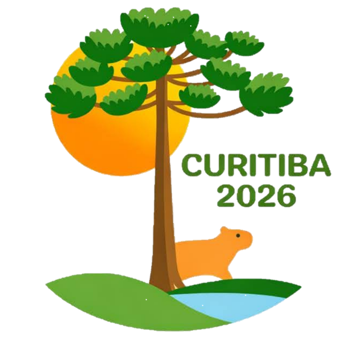

# 🗺️ Sistema de Designações Individuais — Supervisores de Caixas (Congresso 2026)

<p align="center">
  
</p>

<p align="center">
  <strong>Uma aplicação web responsiva e elegante desenvolvida para otimizar a consulta de escalas e turnos de voluntários durante o Congresso Internacional de Curitiba 2026.</strong>
</p>

---

## 📌 Sobre o Projeto

Este sistema foi idealizado com foco total na **Experiência do Usuário (UX)** e no conceito **Mobile First**, visto que a maior parte dos acessos é feita por supervisores em trânsito através de smartphones e tablets. 

A aplicação resolve o problema prático de busca em planilhas extensas, permitindo que o voluntário localize seu nome de forma alfabética e visualize instantaneamente um cartão contendo todas as suas informações de contato, quantidade de turnos e detalhes específicos de suas designações (dia, horário, setor e posição).

### ✨ Funcionalidades Principais
* **Busca Otimizada:** Lista seletiva inteligente com ordenação alfabética automática dos voluntários.
* **Cartão de Designação Detalhado:** Exibição clara dos turnos, setores de atuação e dados de contato de forma isolada.
* **Segurança e Fluidez (Botão Limpar):** Opção rápida de reiniciar a seleção para ocultar os dados da tela após a consulta.
* **Design Responsivo Avançado:** Interface adaptada perfeitamente com *Media Queries* para qualquer tamanho de tela (smartphones, tablets e desktops).
* **Identidade Visual Customizada:** Estilização com paleta de cores pastel suaves e ícones personalizados (Favicon) celebrando a fauna e flora local de Curitiba.

---

## 🛠️ Tecnologias Utilizadas

A pilha de tecnologia foi escolhida visando desempenho, componentização eficiente e deploy simplificado:

* [React.js](https://react.dev/) — Biblioteca Javascript para construção de interfaces.
* [Vite](https://vitejs.dev/) — Ferramenta de build ultra-rápida para o ecossistema frontend.
* [CSS3](https://developer.mozilla.org/pt-BR/docs/Web/CSS) — Estilização moderna utilizando variáveis nativas para gerenciamento de paleta de cores.
* [GitHub Pages](https://pages.github.com/) — Hospedagem automatizada do ambiente de produção.

---

## 🚀 Como Executar o Projeto Localmente

Caso queira clonar o repositório e rodar o ambiente de desenvolvimento em sua máquina:

1. **Clone o repositório:**
   ```bash
   git clone [https://github.com/SEU-USUARIO/designacoes.git](https://github.com/SEU-USUARIO/designacoes.git)